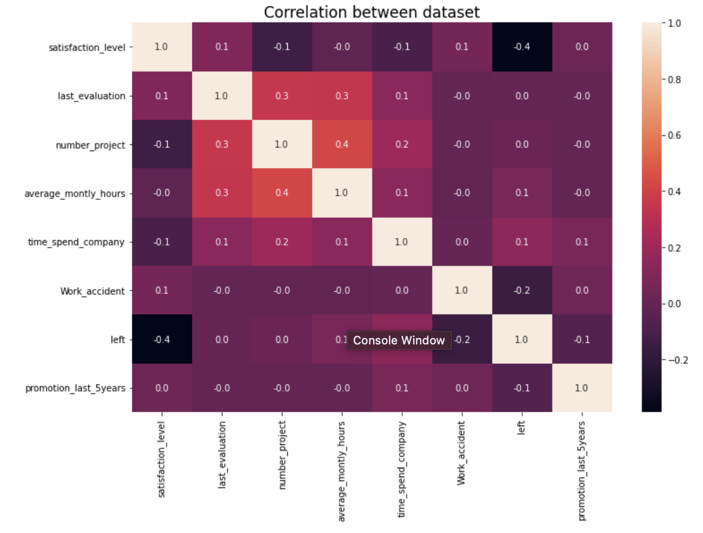
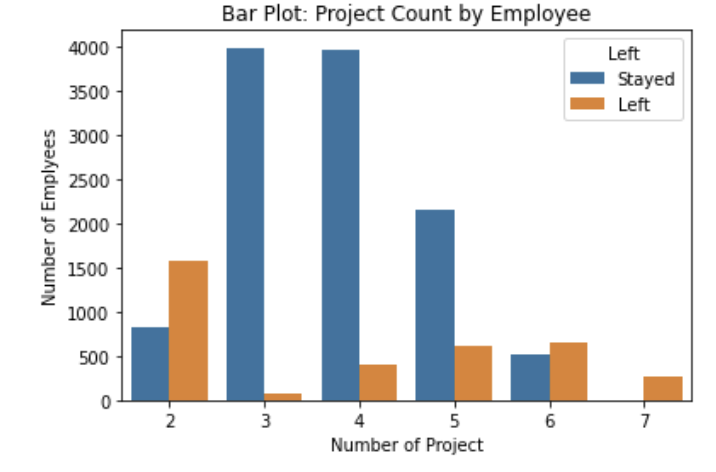
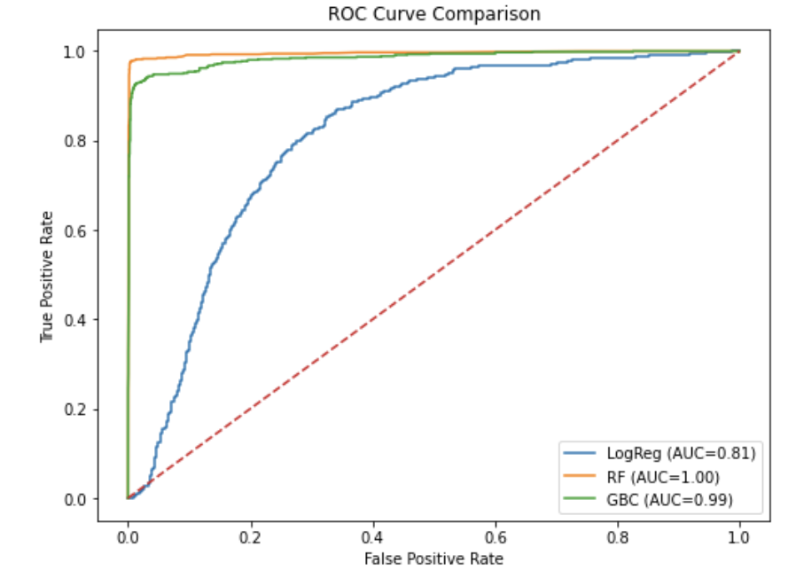

# Employee Turnover Prediction & Retention Strategy

## Problem

Employee turnover leads to increased hiring costs, lost productivity, and disruption in team performance.
The goal of this project is to not only predict which employees are likely to leave, but also identify why and recommend targeted retention strategies.

## Objective

* Build a machine learning model to predict employee turnover
* Identify key drivers of attrition
* Segment employees by risk level
* Provide actionable retention strategies based on predicted risk

## Dataset

* HR employee dataset
* Features include satisfaction level, evaluation scores, workload (projects, hours), tenure, department, and salary

## Tools & Technologies

* Python (Pandas, NumPy)
* Scikit-learn
* Matplotlib / Seaborn
* Jupyter Notebook

---

## Approach

### Exploratory Data Analysis (EDA)

* Analyzed relationships between satisfaction, workload, and turnover
* Identified workload imbalance patterns (underutilized vs overworked employees)
* Used correlation analysis and visualizations to understand key drivers

## Visualizations

### Correlation Heatmap

The heatmap shows that satisfaction level and workload related features have the strongest relationship with employee turnover, reinforcing their importance as key drivers of attrition.

---

### Project Count by Employee Turnover

Employees with very low or very high project counts exhibit higher turnover rates, suggesting that both underutilization and excessive workload contribute to attrition. 

---

### ROC Curve Comparison

The ROC curve demonstrates that the Random Forest model provides the strongest predictive performance, capturing the highest proportion of at-risk employees.

## Key Findings

* **Satisfaction is the strongest predictor of turnover**: Employees with low satisfaction levels show a significantly higher likelihood of leaving, making it the most critical driver of attrition.

* **Workload imbalance drives attrition risk**: Employees with either very low or very high project counts are more likely to leave, indicating both underutilization and burnout as key risk factors.

* **Long working hours increase turnover probability**: Employees working excessive monthly hours are more likely to leave, suggesting workload intensity directly impacts retention.

* **Mid-tenure employees show elevated risk**: Employees within a certain tenure range are more likely to leave compared to newer or long-tenured employees, indicating a critical retention window.

* **Compensation is not the primary driver**: While salary has some impact, behavioral and workload-related factors are stronger predictors of turnover.

Overall, the analysis shows that employee turnover is primarily driven by behavioral and workload factors rather than compensation alone, highlighting the importance of proactive workforce management strategies.
---

### Modeling

* Built multiple classification models:

  * Logistic Regression
  * Random Forest
  * Gradient Boosting

* Applied 5-fold cross-validation

* Evaluated models using precision, recall, and F1-score

### Metric Selection

Recall was prioritized because the business goal is to minimize missed turnover cases.
Failing to identify at-risk employees results in lost opportunities for intervention.

### Model Performance

* Logistic Regression: Recall = 82%
* Gradient Boosting: Recall = 94%
* Random Forest: Recall = 97% (Best Model)

Random Forest was selected due to its ability to capture the highest number of at risk employees, making it the most effective model for minimizing missed turnover cases.
---

## Risk Segmentation Strategy

Employees were segmented based on predicted turnover probability:

* **Safe (Green): < 20%**
* **Low Risk (Yellow): 20% – 60%**
* **Medium Risk (Orange): 60% – 90%**
* **High Risk (Red): > 90%**

This allows the company to move from reactive to proactive retention planning.

---

## Recommendations & Business Actions

### 1. Improve Employee Satisfaction
Focus on engagement initiatives, feedback systems, and career development to address the strongest driver of turnover.

### 2. Balance Workload Distribution
Monitor and adjust project allocation to avoid both underutilization and employee burnout.

### 3. Target High-Risk Employee Segments
Use model predictions to identify and proactively engage employees with elevated turnover risk.

### 4. Focus on Mid-Tenure Retention
Develop targeted retention strategies for employees in critical tenure ranges where attrition risk peaks.

### 5. Move Beyond Compensation-Only Solutions
Address behavioral and workload drivers rather than relying solely on salary adjustments to improve retention.
---

## Business Impact

* Enables early identification of at-risk employees
* Supports targeted retention strategies instead of one-size-fits-all approaches
* Reduces hiring and training costs
* Improves workforce stability and productivity

This approach allows the organization to shift from reactive attrition management to proactive, data driven retention strategies.
